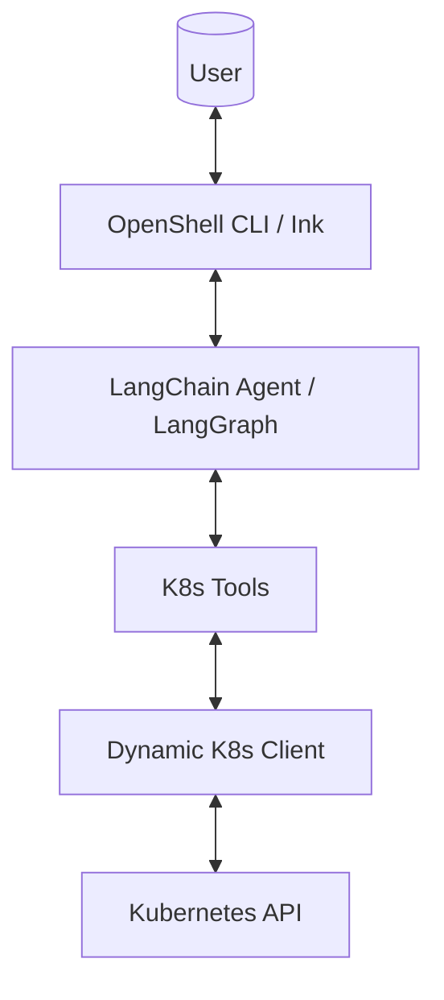

English | [中文](./docs/manual/DEVELOPER.zh-CN.md)

# OpenShell Developer Guide

> This document records the development philosophy, architectural design, and technology stack of the OpenShell project for future developers or AI coding assistants.

## 🎯 Project Vision

OpenShell is an **AI-powered Kubernetes operations assistant**. Users can interact with Kubernetes clusters using natural language, eliminating the need to memorize complex `kubectl` commands.

**Core Features**:

- 🤖 Natural Language Interaction (Supporting English and Chinese)
- 🔧 Automatic Tool Calling (Dynamic resource discovery based on GVK)
- 📡 Streaming Responses (Based on LangGraph updates mode)
- 💻 Terminal Native UI (Built with Ink/React, supporting native terminal scrolling)

---

## 📐 Architecture Design

### Overall Architecture



### Project Structure (Flattened)

```
openshell/
├── src/
│   ├── core/                 # Core Library (ESM)
│   │   ├── ai/               # AI Agent Logic
│   │   │   ├── agent.ts      # Agent creation and streaming logic
│   │   │   └── tools.ts      # Consolidated K8s tools
│   │   ├── kubernetes/
│   │   │   └── client.ts     # Dynamic K8s Client (GVK resolution)
│   │   └── index.ts          # Unified exports
│   └── ui/                   # CLI Application (React/Ink)
│       ├── AppContainer.tsx     # Main UI and streaming handler
│       ├── MessageComponent.tsx # Message rendering logic
│       ├── i18n.ts              # Internationalization config
│       └── index.tsx            # CLI entry and arg parsing
├── docs/manual/              # Manuals and non-default language docs
├── scripts/                  # Operations scripts
├── package.json              # Project configuration
└── ~/.openshell/.env           # Global config (OPENAI_API_KEY, etc.)
```

---

## 🛠 Technology Stack

### Runtime

- **Node.js**: >= 20.0.0
- **TypeScript**: ^5.3.3
- **ESM**: Full adoption of the ESM module system

### UI Layer

- **Ink**: `^6.6.0` (React terminal renderer)
- **React**: `^19.2.0`
- **Yargs**: `^17.7.2` (Argument parsing)

### AI Layer

- **LangChain**: `^1.2.10`
- **LangGraph**: `1.1.1` (Manages Agent图 graph workflows)
- **OpenAI SDK**: `6.16.0`
- **Zod**: `4.3.5` (Schema definition)

### Kubernetes Layer

- **@kubernetes/client-node**: `1.4.0`

---

## 🔑 Core Modules

### 1. Dynamic Kubernetes Client (`client.ts`)

To support almost all Kubernetes resources (including Custom Resource Definitions - CRDs), we use a **dynamic client architecture**:

- **GVK Resolution**: The `resolveResourceGVK` function resolves resource abbreviations into the correct apiVersion and Kind.
- **Unstructured Operations**: Uses `KubernetesObjectApi` for operations, decoupled from specific models.
- **Unified Interface**: Legacy redundant methods have been replaced by a consistent `listUnstructuredResources` approach.

### 2. AI Agent and Streaming (`agent.ts` & `AppContainer.tsx`)

- **StreamMode**: Uses `updates` mode for real-time output from Agent nodes.
- **Conversation Memory**: Integrated with `MemorySaver` for multi-turn context.
- **Message Accumulation**: `AppContainer` updates the message state in the UI as streaming chunks are received.

## 🚀 Extension Guide

### Adding New Tools

1. Define the tool using the `tool()` API in `src/core/ai/tools.ts`.
2. Ensure input parameters are accurately described using `zod`.
3. Add the new tool to the array returned by `createK8sTools`.

### Adjusting UI Styles

- `AppContainer.tsx` handles the overall layout.
- `MessageComponent.tsx` handles individual message rendering.

---

## 🏗 Development Workflow

### Common Commands

```bash
npm install        # Install dependencies
npm run build      # Build the project
npm start          # Start interactive CLI
```

---

## 📝 Changelog

| Version | Date    | Major Updates                                                                             |
| ------- | ------- | ----------------------------------------------------------------------------------------- |
| 0.1.0   | 2026-01 | **Initial Release**: Streaming output, dynamic K8s resource discovery, bilingual support. |
| 0.1.2   | 2026-01 | **UX Enhancement**: Cursor navigation, command history, multi-turn memory.                |

---

_Last Updated: 2026-01-21_
