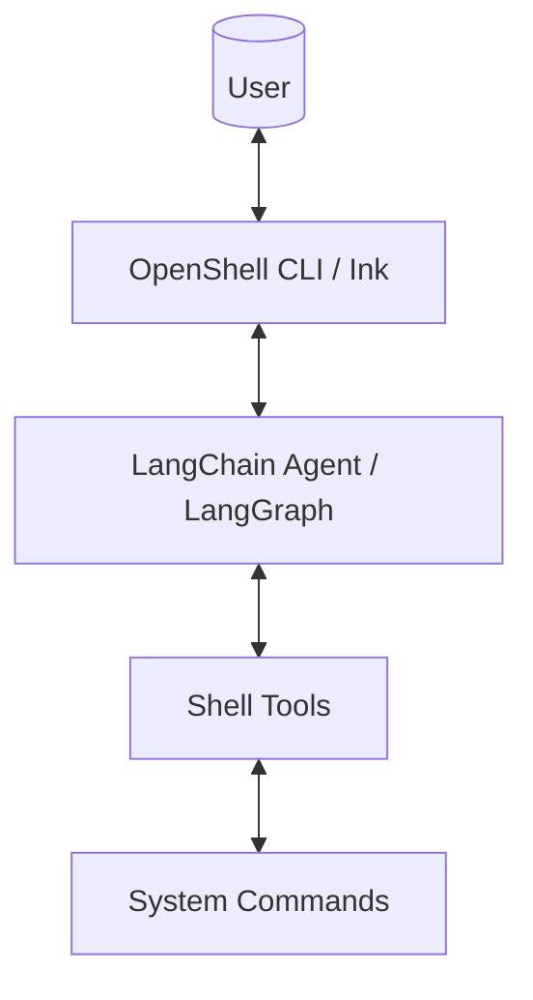

English | [中文](./docs/manual/DEVELOPER.zh-CN.md)

# OpenShell Developer Guide

> This document records the development philosophy, architectural design, and technology stack of the OpenShell project for future developers or AI coding assistants.

## 🎯 Project Vision

OpenShell is an **AI-powered shell operations assistant**. Users can interact with their system using natural language, eliminating the need to memorize complex commands.

**Core Features**:

- 🤖 Natural Language Interaction (Supporting English and Chinese)
- 🔧 Automatic Tool Calling (Dynamic command execution)
- 📡 Streaming Responses (Based on LangGraph updates mode)
- 💻 Terminal Native UI (Built with Ink/React, supporting native terminal scrolling)

---

## 📐 Architecture Design

### Overall Architecture



### Project Structure (Flattened)

```
openshell/
├── src/
│   ├── core/                 # Core Library (ESM)
│   │   ├── ai/               # AI Agent Logic
│   │   │   ├── agent.ts      # Agent creation and streaming logic
│   │   │   └── tools.ts      # Shell tools definition
│   │   ├── session/          # Session management
│   │   └── utils/            # Utility functions
│   │   └── index.ts          # Unified exports
│   └── ui/                   # CLI Application (React/Ink)
│       ├── AppContainer.tsx     # Main UI and streaming handler
│       ├── MessageComponent.tsx # Message rendering logic
│       ├── i18n.ts              # Internationalization config
│       └── index.tsx            # CLI entry and arg parsing
├── docs/manual/              # Manuals and non-default language docs
├── scripts/                  # Operations scripts
├── package.json              # Project configuration
└── ~/.openshell/.env           # Global config (OPENAI_API_KEY, etc.)
```

---

## 🛠 Technology Stack

### Runtime

- **Node.js**: >= 20.0.0
- **TypeScript**: ^5.3.3
- **ESM**: Full adoption of the ESM module system

### UI Layer

- **Ink**: `^6.6.0` (React terminal renderer)
- **React**: `^19.2.0`
- **Yargs**: `^17.7.2` (Argument parsing)

### AI Layer

- **LangChain**: `^1.2.10`
- **LangGraph**: `1.1.1` (Manages Agent graph workflows)
- **OpenAI SDK**: `6.16.0`
- **Zod**: `4.3.5` (Schema definition)

### System Layer

- **Node.js child_process**: Native command execution
- **@kubernetes/client-node**: `1.4.0` (Optional, for future K8s extensions)

---

## 🔑 Core Modules

### 1. Shell Tools (`tools.ts`)

The tool system provides command execution capabilities:

- **execute_command**: Cross-platform command execution (bash/zsh on Unix, PowerShell/cmd on Windows)
- **Error Handling**: Returns user-friendly error messages
- **Schema Validation**: Uses Zod for input parameter validation

### 2. AI Agent and Streaming (`agent.ts` & `AppContainer.tsx`)

- **StreamMode**: Uses `updates` mode for real-time output from Agent nodes.
- **Conversation Memory**: Integrated with `MemorySaver` for multi-turn context.
- **Message Accumulation**: `AppContainer` updates the message state in the UI as streaming chunks are received.
- **HITL (Human-in-the-Loop)**: Sensitive operations require user approval before execution.

## 🚀 Extension Guide

### Adding New Tools

1. Define the tool using the `tool()` API in `src/core/ai/tools.ts`.
2. Ensure input parameters are accurately described using `zod`.
3. Add the new tool to the array returned by `createShellTools`.
4. For sensitive operations, add HITL configuration in `src/core/ai/agent.ts`.

### Adjusting UI Styles

- `AppContainer.tsx` handles the overall layout.
- `MessageComponent.tsx` handles individual message rendering.

---

## 🏗 Development Workflow

### Common Commands

```bash
npm install        # Install dependencies
npm run build      # Build the project
npm start          # Start interactive CLI
```

---

## 📝 Changelog

| Version | Date    | Major Updates                                                                      |
| ------- | ------- | ---------------------------------------------------------------------------------- |
| 0.1.0   | 2026-01 | **Initial Release**: Streaming output, shell command execution, bilingual support. |
| 0.1.2   | 2026-01 | **UX Enhancement**: Cursor navigation, command history, multi-turn memory.         |
| 1.0.0   | 2026-03 | **General Purpose Shell**: Migrated from K8s-specific to general shell operations. |

---

_Last Updated: 2026-03-12_
