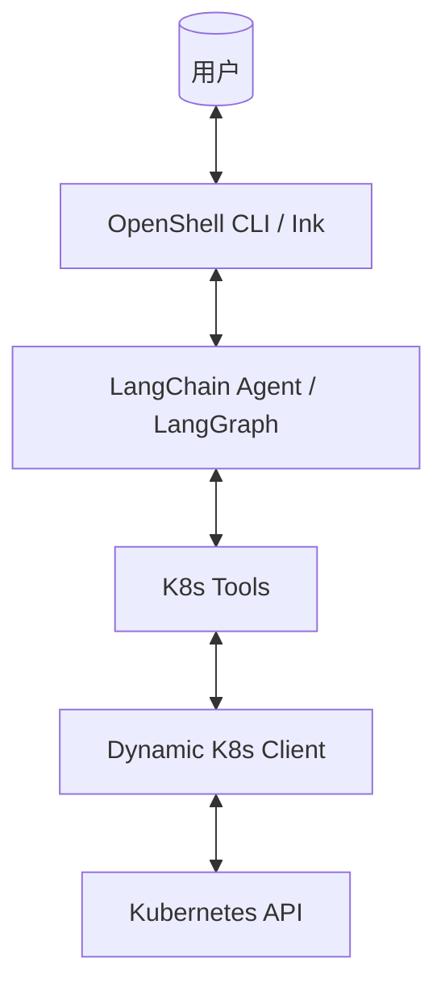

[English](../../DEVELOPER.md) | 中文

# OpenShell 开发者指南

> 本文档记录 OpenShell 项目的研发思路、架构设计和技术栈，以供后续开发者或代码助手继续研发。

## 🎯 项目愿景

OpenShell 是一个 **AI 驱动的 Kubernetes 运维助手**，用户可以通过自然语言与 Kubernetes 集群交互，无需记忆复杂的 kubectl 命令。

**核心特点**:

- 🤖 自然语言交互（支持中英文）
- 🔧 自动工具调用（基于 GVK 动态发现资源）
- 📡 流式响应（基于 LangGraph updates 模式）
- 💻 终端原生 UI（使用 Ink/React，支持原生滚动）

---

## 📐 架构设计

### 整体架构



### 项目结构

```
openshell/
├── src/
│   ├── core/                 # 核心库 (ESM)
│   │   ├── ai/               # AI Agent 相关逻辑
│   │   │   ├── agent.ts      # Agent 创建与流式响应逻辑
│   │   │   └── tools.ts      # 整合后的 K8s 工具集合
│   │   ├── kubernetes/
│   │   │   └── client.ts     # 动态 K8s 客户端 (GVK 解析)
│   │   └── index.ts          # 统一导出
│   └── ui/                   # CLI 应用 (React/Ink)
│       ├── AppContainer.tsx     # 主界面与流式处理
│       ├── MessageComponent.tsx # 消息渲染逻辑
│       ├── i18n.ts              # 多语言配置
│       └── index.tsx            # 命令行入口与参数解析
├── docs/manual/              # 用户手册与非默认语言文档
├── scripts/                  # 运维辅助脚本
├── package.json              # 项目配置文件
└── ~/.openshell/.env           # 全局配置 (OPENAI_API_KEY 等)
```

---

## 🛠 技术栈

### 运行时

- **Node.js**: >= 20.0.0 (必须)
- **TypeScript**: ^5.3.3
- **ESM**: 全面采用 ESM 模块化系统

### UI 层

- **Ink**: `^6.6.0` (React 终端渲染器)
- **React**: `^19.2.0`
- **Yargs**: `^17.7.2` (参数解析)

### AI 层

- **LangChain**: `^1.2.10`
- **LangGraph**: `1.1.1` (管理 Agent 图工作流)
- **OpenAI SDK**: `6.16.0`
- **Zod**: `4.3.5` (Schema 定义)

### Kubernetes 层

- **@kubernetes/client-node**: `1.4.0`

---

## 🔑 核心模块详解

### 1. 动态 Kubernetes 客户端 (`client.ts`)

为了支持几乎所有的 Kubernetes 资源（包括自定义资源 CRD），我们引入了 **动态客户端架构**：

- **GVK 解析**：`resolveResourceGVK` 函数根据用户输入的资源缩写解析为正确的 apiVersion 和 Kind。
- **Unstructured 操作**：使用 `KubernetesObjectApi` 进行操作，不再绑定特定的 Model。
- **简化接口**：移除了冗余的方法，统一由 `listUnstructuredResources` 覆盖。

### 2. AI 代理与流式处理 (`agent.ts` & `AppContainer.tsx`)

- **StreamMode**: 使用 `updates` 模式，允许实时获取 Agent 节点的输出。
- **对话记忆**: 集成了 `MemorySaver`，支持多轮对话上下文。
- **消息累积**：`AppContainer` 会在接收到流式 chunk 时，实时更新 UI 中的消息状态。

## 🚀 扩展指南

### 添加新工具

1. 在 `src/core/ai/tools.ts` 中使用 `tool()` API 定义。
2. 确保输入参数通过 `zod` 进行了准确描述。
3. 在 `createK8sTools` 函数的返回数组中添加您的新工具。

### 调整 UI 样式

- `AppContainer.tsx` 负责整体布局。
- `MessageComponent.tsx` 负责单个消息渲染。

---

## 🏗 开发流程

### 常用命令

```bash
npm install        # 安装依赖
npm run build      # 构建项目
npm start          # 启动交互式 CLI
```

---

## 📝 更新日志

| 版本  | 日期    | 重大更新                                                                  |
| ----- | ------- | ------------------------------------------------------------------------- |
| 0.1.0 | 2026-01 | **初始版本发布**：支持流式输出、动态 K8s 资源发现、中英双语、命令行直查。 |
| 0.1.2 | 2026-01 | **交互体验增强**：支持光标移动、命令历史、多轮对话记忆。                  |

---

_文档最后更新: 2026-01-21_
